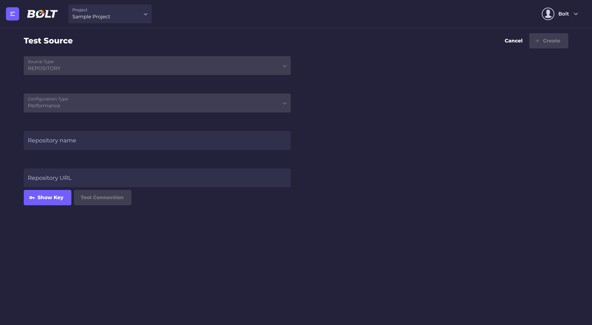
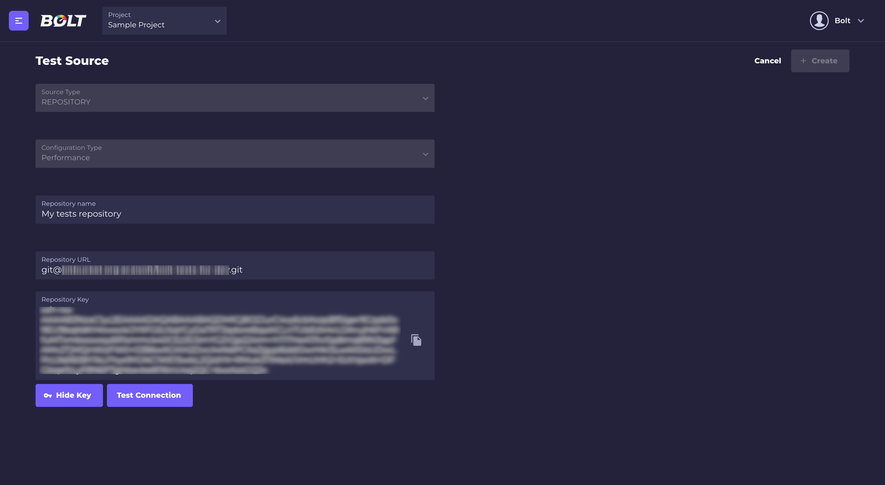
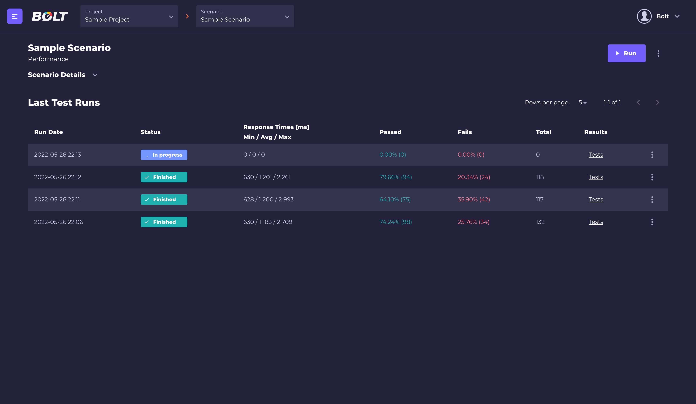
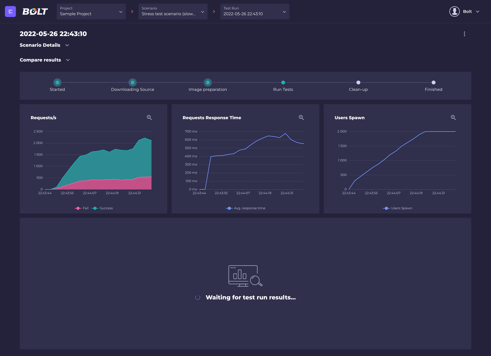
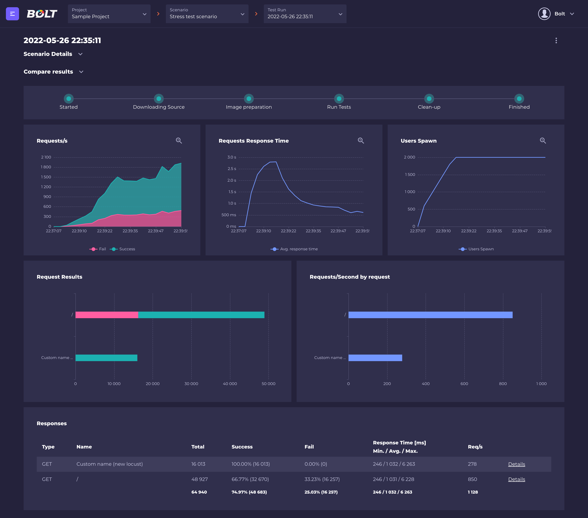
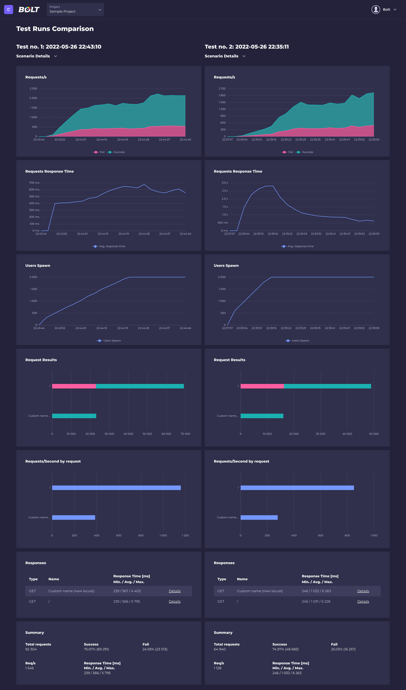
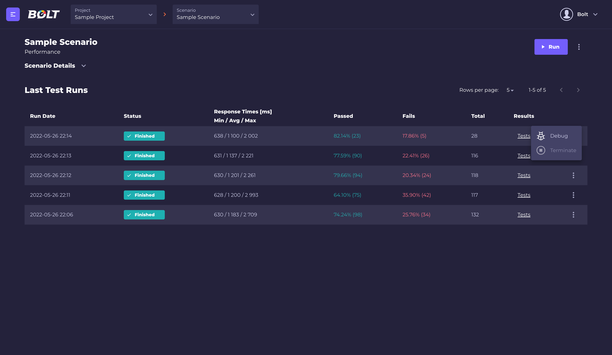

### AcaiBolt - 1.0.0-beta

The platform that helps predicting system limitation and addresses scalability needs:
* We provide ability to implement complex test scenarios,
* Test scenario code doesn't have to be kept in single script file (all the logic can be implemented in proper and user friendly structure),
* Third party packages can be used for implementing test scenarios,
* Uses well known open-source Locust format for writing test cases.

### Repositories
* https://github.com/Acaisoft/bolt-api
* https://github.com/Acaisoft/bolt-portal
* https://github.com/Acaisoft/bolt-builder
* https://github.com/Acaisoft/bolt-workflow-creator
* https://github.com/Acaisoft/bolt-workflow-terminator
* https://github.com/Acaisoft/bolt-platform-helm
* https://github.com/Acaisoft/bolt-helm-charts

### Requirements
* Google Kubernetes Cluster
  * two n1-standard-4 nodes (for Bolt control plane)
  * horizontally scalable n1-standard-4 node group (for test runners)
* PostgreSQL 14

### Installation
Follow instructions under **https://github.com/Acaisoft/bolt-platform-helm**

### Writing tests

Tests should be written with Locust framework (python framework for performance testing). Bolt supports Locust's version 2.8.6. Full Locust's documentation and tutorials are available on official webpage: **https://docs.locust.io/en/2.8.1/**

Test scripts may use external packages (defined in requirements.txt file), and packages written by the user. The only requirement for tests is that "locust file" (file with test script) should be located in `tests` directory.

### Usage
#### Creating new project
Projects are a way to keep your tests in order, for example if you are testing a few different systems, you can create a project for each of them and group different scenarios (see below) in one project.<br/>
<br/>
All projects are displayed in the Dashboard view.
#### Adding test source to the project
Test source is a repository where you keep your test scripts, all created packages, requirements and other files.
1. Using menu on the left side, go to "Test Source": <br/>
<br/>
2. Click "Create a test source" (if there are no test sources defined) or "+New" button:<br/>
<br/>
3. Fill test source form:<br/>
<br/>
**Repository name**: it's a user friendly name which will be displayed in Bolt (for example in Create scenario form). <br/>
**Repository URL**: it's a URL to your repository in the `git@{repository}.git` format (you can find it in your VCS). <br/>
Add provided public key to your git repository so Bolt will be able to fetch your test code. Click on "Show Key" button and Bolt's public key will be displayed.:<br/>
<br/> 
copy the key and add it in your VCS.
4. Click "Test connection button"
5. If Bolt is able to connect with your repository,  the "Create" button will be active.
6. Click the "Create" button.

#### Creating test scenario
Test scenario is a configuration of your test. When running a test with the same scenario it's easy to compare results between tests performed with the same test configuration. It's also easy to keep different configurations in order (for example you can create scenarios with different number of users or hosts, and easily compare results between them).

1. Using the menu on the left side, go to "Test Scenarios":<br/>
<br/>
2. Click "Create a test source" (if there is no test sources defined) or "+New" button:<br/>
<br/>
3. Fill test scenario form: <br/>
**Name**: it's user friendly name of your scenario which will be displayed in Bolt. <br/>
**Test parameters**: basic parameters of load test: <br/>
<br/>
* time: test duration
* users/second: defines how many users will be spawn every second until maximum number of users is reached
* host: basic url of your test
* users: maximum number of users. <br/>
**Test source**:<br/>
<br/>
In this section you can select which test source (defined in the previous step) will be used for the test. Also, it's possible to define which branch of repository will be used, and the name of the test file (**this file need to be located in `tests` directory**). <br/>
**Environment variables:**
Bolt also provides ability to use environment variables which are passed into the image. You can define them in scenario details and refer to them in the test code. For example, if you want to control endpoint name, based on environment variable:
```python
@task
def basic_get_request():
    if 'ABC' in getenv('MY_CUSTOM_VAR'):
        self.client.get('/abc')
    else:
        self.client.get('/efg')
```
<br/>


#### Cloning test scenario
If you want to create a new test scenario with only minor changes, you don't have to fill all the data again, just use a "Clone" option, which is available from the scenarios list and scenario details view.

#### Running tests
When scenario is ready, you can start the test by clicking the "Run" button from test scenario details view:<br/>
<br/>
Bolt will create an image based on your test's repository, orchestrate all the locust nodes and gather the test's results. <br/>
Basic tests data is displayed in real time (total number of requests, successes and failures, average response time and number of currently spawned users.)<br/>
<br/>

#### Gathering and comparing test results
When the test run is finished, Bolt will display detailed results for every endpoint (or custom-named request in the locust file).<br/>
<br/>

It's also possible to see time distribution and failures details for every request (just click on "Details" button)<br/>
<br/>

Bolt also gives you the possibility to compare results from two different test runs (even from different scenarios), so it's very easy to check how changing the configuration affects your tests. To compare the test runs results, click the "Compare results" button from test run details view and select scenario and another test run to compare with the current test run.<br/>
<br/>
Only finished and succeeded test runs are selectable for the comparison.<br/>
 <br/>
 
#### Debugging and Cold Run
If, for any reasons, your test didn't start or failed you can check the logs from the pods with "Debug" option, which is available from the test runs list and the single test run views:<br/>
<br/>
Debug UI is publicly available and needs to be manually turned off if it poses security risk for the end user.
By default, Bolt uses cached images (and rebuilds them if something has changed in tests repository), but it's possible to perform a cold run which forces Bolt to rebuild test images even if nothing has changed in your code. To perform a cold run, select "Cold Run" option available near the "Run" button in the scenario details view.

### License
Open source licensed under the MIT license (see LICENSE file for details).